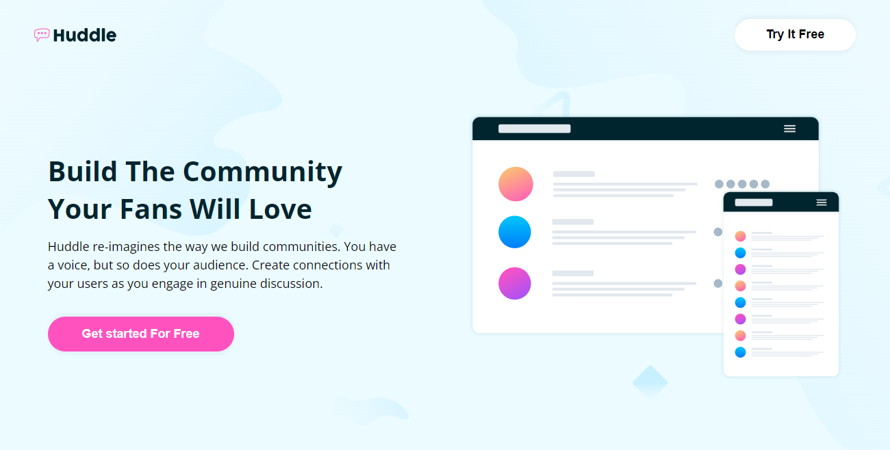

# Frontend Mentor - Huddle landing page with alternating feature blocks solution

## Table of contents

- [Overview](#overview)
  - [The challenge](#the-challenge)
  - [Screenshot](#screenshot)
- [My process](#my-process)
  - [Built with](#built-with)
  - [What I learned](#what-i-learned)
  - [Continued development](#continued-development)
  - [Useful resources](#useful-resources)
- [Author](#author)

## Overview

### The challenge

Users should be able to:

- View the optimal layout for the site depending on their device's screen size
- See hover states for all interactive elements on the page

### Screenshot

## My process

### Built with

- Semantic HTML5 markup
- CSS custom properties
- Flexbox
- CSS Grid
- Mobile-first workflow

### What I learned

I learned tons about this project, I think it stretched me a bit especially the footer was a little pain in the ass however, I made it through so yeah 👌😊

### Continued development

This project was all about layouts so i think going forward i will continue improving my skills in layout building in css.

### Useful resources

- [Stack Overflow](https://www.stackoverflow.com) - I learned some grid two even columns trick on stack overflow.
- [Css tricks](https://www.csstricks.com) - I read about max-width on this css tricks website.

## Author

- George Asiedu - [@george5-star](https://www.frontendmentor.io/profile/george5-star)
